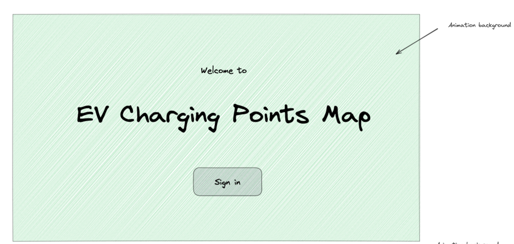
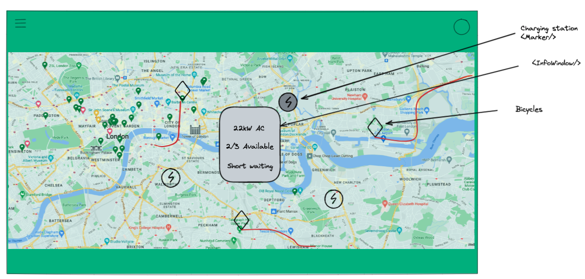
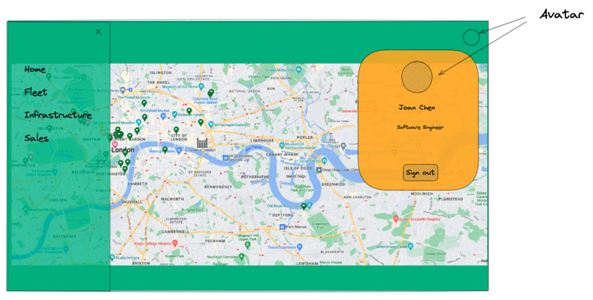
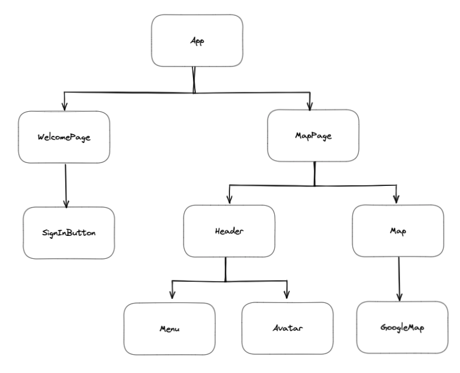

# EV Charging Points Map
**Table of Contents**
1. [UI-Design](#{UI-Design}) 
2. [Components](#{Components})
3. [Tools](#{Tools})

## Low-fidelity UI Design

### Welcome Page

 

### Map Page

 

### Widgets

 

## Components

 

## Tools 

 
  

